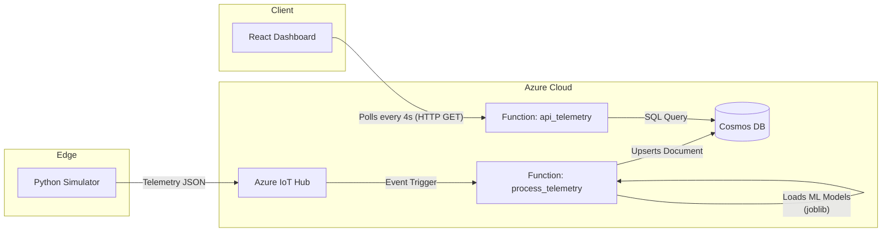

# Predictive Maintenance IoT - Codebase Guide

This document provides a comprehensive onboarding guide to the Predictive Maintenance IoT codebase. It is based on a strict audit of the files, folder structure, and git history.

## 1. Problem Statement
**What the README claims:** The system ingests high-frequency telemetry from industrial machinery, applies machine learning to predict equipment failures, and presents this data through a real-time monitoring dashboard.
**What the code actually does [CONFIRMED]:** The system *simulates* industrial machinery via a Python script, sending telemetry to Azure IoT Hub. An Azure Function enriches this with ML predictions (using pre-trained `scikit-learn` models) and saves it to Cosmos DB. A React dashboard polls another Azure Function every 4 seconds to display the data. It also includes an offline "sandbox" mode in the frontend to simulate data without a backend.
**Inputs:** Simulated hardware metrics (temperature, vibration, RPM, current) from `simulator/run_simulator.py`.
**Outputs:** 
- Cosmos DB JSON documents containing telemetry + `failure_probability_ml` and `rul_hours_ml`.
- A visual React dashboard displaying charts and alerts.

## 2. Solution Overview
**Plain Language:** This is a digital factory simulation. It pretends to be 10 machines (CNCs, Compressors, Pumps) that are slowly breaking down. As they generate data, a cloud AI guesses when they will fail and shows a warning on a web dashboard so operators can "repair" them before they break.
**Technical:** The solution is an event-driven serverless architecture.
- **Python (Simulator):** Lightweight edge simulation.
- **Azure IoT Hub:** Scalable ingestion pipeline.
- **Azure Functions (Python):** Serverless compute. Used because it scales automatically per IoT message and avoids 24/7 VM costs.
- **Azure Cosmos DB:** Globally distributed NoSQL database, chosen for rapid JSON upserts and fast reads.
- **React / Vite / TypeScript:** Fast, modern frontend tooling for the dashboard.

## 3. Architecture

*Data flow [CONFIRMED via config.py, App.tsx, and __init__.py files]*

## 4. Walkthrough

### Core Modules & Responsibilities
- `simulator/run_simulator.py`: **Responsibility:** The entry point loop. Creates machines and sends data every `TELEMETRY_INTERVAL` seconds. **If removed:** No data enters the cloud.
- `simulator/config.py`: **Responsibility:** Defines baseline metrics and degradation rates for 10 machines. Machines 3 and 7 are hardcoded to degrade rapidly for demo purposes.
- `azure-functions/process_telemetry/__init__.py`: **Responsibility:** Ingests IoT Hub events, imports `predict.py` to run ML models, and saves to Cosmos DB. **If removed:** The database never updates.
- `azure-functions/api_telemetry/__init__.py`: **Responsibility:** Exposes an HTTP GET endpoint (`/api/api_telemetry`) that queries Cosmos DB. **If removed:** The dashboard goes offline.
- `react-dashboard/src/App.tsx`: **Responsibility:** The entire frontend application. Handles polling, charting (Recharts), and offline simulation.

### Trace: Telemetry Ingestion Flow [CONFIRMED]
1. `simulator/run_simulator.py` calls `machine.tick()` which applies a degradation rate to metrics (e.g., temperature increases).
2. It sends a JSON payload to IoT Hub.
3. Azure Function `process_telemetry` is triggered.
4. It calls `predict(payload)`, which loads `failure_clf.joblib` and `rul_reg.joblib`.
5. The enriched payload is written to Cosmos DB `TelemetryContainer` partitioned by `/deviceId`.

### Trace: Dashboard Visualization Flow [CONFIRMED]
1. `App.tsx` initializes a `setInterval` to run every 4 seconds.
2. It fetches from `http://localhost:7071/api/api_telemetry`.
3. `api_telemetry/__init__.py` receives the request, connects to Cosmos DB, and runs `SELECT * FROM c`.
4. It strips internal DB fields (`_rid`, `_etag`) and returns the JSON array.
5. React updates state, re-rendering the UI charts and status cards.

## 5. Key Design Decisions
- **Thick Frontend Sandbox Mode [CONFIRMED]:** If the backend is down, `App.tsx` falls back to `initLocalSimulation()` and `calculateMLFields()`. *Alternative:* Just show an error screen. *Tradeoff:* Makes the React app heavier and duplicates logic, but ensures the demo never breaks for presentations.
- **HTTP Polling over WebSockets [CONFIRMED]:** The React app uses `setInterval` to fetch data. *Alternative:* SignalR or WebSockets. *Tradeoff:* HTTP Polling is much easier to deploy in Azure Functions but scales poorly if thousands of clients connect.
- **Git History Squash [CONFIRMED]:** The Git history was completely wiped and re-initialized in a single commit (`cc0263e`) on August 11, 2026. *Impact:* We cannot see the incremental evolution of the code or granular commit messages for debugging.

## 6. Drawbacks and Limitations
1. **[Severity 1] Hardcoded Localhost API:** `App.tsx` hardcodes `http://localhost:7071` (Lines 261, 432). *Impact:* The dashboard cannot be deployed to a production URL without breaking the API connection.
2. **[Severity 2] Missing Endpoints:** `App.tsx` attempts to POST to `http://localhost:7071/api/repair_device` (Line 432), but this Azure Function does not exist in the codebase. *Impact:* The UI "Repair" button is functionally broken in live mode.
3. **[Severity 2] Zero Automated Tests:** A search for `*test*` outside of `node_modules` yields 0 results. *Impact:* Refactoring the ML prediction or simulator logic carries a high risk of regressions.
4. **[Severity 3] Infinite Database Growth:** `process_telemetry` uses `upsert_item` based on a composite ID (`deviceId-timestamp`), meaning it inserts a new row every 5 seconds per machine. *Impact:* Cosmos DB storage costs will grow infinitely. There is no TTL (Time to Live) policy defined in the code.

## 7. Setbacks and Unfinished Work
- **The Missing Repair Flow [CONFIRMED]:** The frontend has a `repair_device` POST request, but there is no corresponding backend code. The developer likely abandoned the cloud-side repair logic and fell back to relying on the offline sandbox mode for demos.
- **Duplicate ML Logic [CONFIRMED]:** The ML models are trained in `ml-model/` and deployed to `azure-functions/`. However, `App.tsx` contains its own hardcoded heuristic function (`calculateMLFields`) to fake the ML output.

## 8. Setup and Troubleshooting

### Running the Stack
1. **Cloud API:** `cd azure-functions` -> `func start`
2. **Simulator:** `cd simulator` -> `python main.py`
3. **Frontend:** `cd react-dashboard` -> `npm run dev`

### Failure Modes
| Symptom | Probable Cause | Where to Look | Fix |
|---|---|---|---|
| Dashboard shows "Initializing" forever | React StrictMode / Offline Fallback race condition | `App.tsx` `useEffect` | Ensure local REST API is running before opening the app. |
| Clicking "Repair" throws a 404 Error | The `repair_device` function does not exist | Network Tab / `App.tsx` | Implement `api_repair` in `azure-functions`. |
| Cannot deploy Dashboard to Vercel/Netlify | Hardcoded `localhost` in fetch calls | `App.tsx` Line 261 | Replace with `process.env.VITE_API_URL`. |

*Note: The missing repair endpoint is confirmed. The forever "Initializing" bug is inferred based on standard React 18 StrictMode lifecycle behaviors with thick initialization logic.*

## 9. Where to Change Things
- **To add a new simulated machine:** Edit `MACHINE_PROFILES` in `simulator/config.py` and `INITIAL_PROFILES` in `App.tsx`.
- **To change API connection URL:** Edit `fetch` strings in `react-dashboard/src/App.tsx`.
- **To alter machine degradation speeds:** Edit `degrade_rate` in `simulator/config.py` (specifically `get_profile()` index overrides).
- **To update the Machine Learning model:** Run `python generate_data.py`, then `python train.py` in `/ml-model`, and copy the `.joblib` files to `/azure-functions/process_telemetry`.

## 10. Glossary
- **RUL:** Remaining Useful Life. The estimated hours before a machine requires maintenance.
- **Telemetry:** The JSON payload consisting of `temperature`, `vibration`, `rpm`, and `current`.
- **Sandbox Mode:** A frontend-only state where the React app fakes the IoT backend to maintain demo functionality.
- **E-Stop:** Emergency Stop. Flagged as `isShutdown` in the database.

## 11. Open Questions for Maintainers
1. Was the `repair_device` Azure Function intentionally left out, or lost during the Git squash?
2. Should we implement a Cosmos DB Time-to-Live (TTL) to prevent indefinite storage growth?
3. Can we unify the hardcoded `INITIAL_PROFILES` in React with the `MACHINE_PROFILES` in Python to establish a single source of truth?

---

### Test Your Understanding
*If you truly understand this codebase, you should be able to answer these 10 questions:*
1. How does the frontend dashboard know if it should connect to the cloud or use the offline sandbox mode?
2. Why do machines `sim-machine-003` and `sim-machine-007` fail much faster than the others?
3. Where precisely in the backend does the raw telemetry get enriched with ML predictions?
4. What happens to the Cosmos DB storage footprint over time if the simulator runs continuously?
5. Why will the dashboard fail to fetch live data if you deploy it to a public web server right now?
6. What happens if a machine's `isShutdown` property is set to true during ML scoring?
7. What triggers the `process_telemetry` Azure Function to execute?
8. How does the React app avoid an infinite re-render loop while polling an API every 4 seconds?
9. Which two machine learning model types (algorithms) were chosen for this project, and what does each predict?
10. Why doesn't the "Repair" button work when the dashboard is in "Live" mode?
